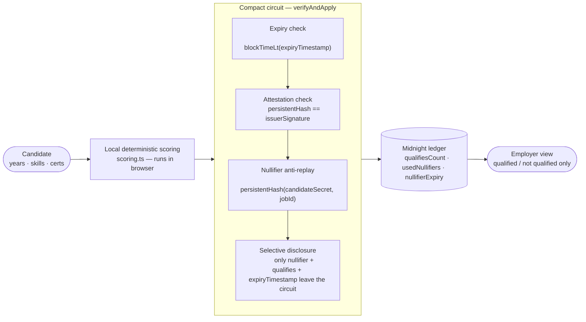

# FairHire

**Track:** Best Beginner Hack — first hackathon
**Event:** MLH x Midnight Hackathon (August 28–30, 2026)

Recruitment screening is biased before a candidate's qualifications are ever
evaluated — names, age, gender, and photos influence the decision before
skills do. FairHire lets a candidate prove *"I qualify for this job"* with a
zero-knowledge proof on Midnight Network, so the employer's screening view
sees only a qualified/not-qualified result and an anti-replay nullifier —
never the CV behind it.

## Architecture



The match score itself is a simple, explicitly-chosen weighted formula, not a
trained model — deterministic and auditable, with no black box that could
discriminate illegally.

## Features

The app has four screens: **Candidate** (generate a proof), **Employer**
(the qualification-only dashboard + ROI calculator), **Compare** (side-by-side
contrast), and the **Payload Inspector** modal (what's actually in the
transaction).

### Nullifier expiry

Every proof is scoped to a job posting's expiry — set on the Candidate form
as "Job posting expires in (days)" — so a proof generated for a since-expired
posting can't be submitted, and an old proof can't be replayed against a job
that's no longer accepting applications. The expiry timestamp is itself
disclosed on-chain (visible in the Payload Inspector, next to the nullifier
and the verdict) so the check is auditable, not just asserted. See
[How nullifier expiry works](#how-nullifier-expiry-works) below.

### Compare — see the difference

A side-by-side view of the same candidate going through two hiring flows: a
traditional application (fictional name, age, photo placeholder, full resume
text) next to what FairHire's employer screen actually receives (a
qualified/not-qualified verdict and a nullifier — nothing else). Once you've
generated a proof in the Candidate tab, the FairHire side reflects your real
result instead of illustrative data.

### ROI calculator

A small, honestly-framed estimator on the Employer tab: given "applications
per month," it estimates how many screening decisions per month/year could
be affected by name-based signal, using the average contact-rate gap from
Kline, Rose & Walters (2022), *Systemic Discrimination Among Large U.S.
Employers* (QJE) — 2.1 percentage points across 83,000+ real applications to
108 large U.S. employers — alongside Bertrand & Mullainathan (2004), *Are
Emily and Greg More Employable Than Lakisha and Jamal?* (AER), for context.
Both are cited inline with links to the source. Framed explicitly as an
estimate based on published research, not a guaranteed outcome for any
specific employer.

## Setup & run

```bash
npm install
docker compose up -d        # starts the Midnight proof server on :6300
npm run dev                 # http://localhost:3000
```

Compile the contract (compiled output is gitignored, so this is needed once
per clone, or after editing `contracts/eligibility.compact`):

```bash
compact compile contracts/eligibility.compact contracts/managed/eligibility
```

> On Windows, `compact` on the native PATH is the OS's NTFS-compression tool,
> not the Midnight CLI — run it inside WSL instead:
> `wsl.exe -d Ubuntu -- bash -lc "cd /mnt/c/path/to/FairHire && compact compile contracts/eligibility.compact contracts/managed/eligibility"`

With the proof server running, open the **Candidate** tab, pick a preset,
and generate a proof (real PLONK proving, ~12–15s). Switch to **Employer**
for the qualification-only dashboard and the ROI calculator, **Compare** to
see the same candidate go through both hiring flows side by side, and use
the **Payload Inspector** modal to see exactly what stays private vs. what's
disclosed.

Run the circuit's test suite (executes the compiled `verifyAndApply` circuit
directly via `@midnight-ntwrk/compact-runtime`, no proof server needed):

```bash
npm test
```

## How nullifier expiry works

`verifyAndApply` takes an `expiryTimestamp: Uint<64>` (Unix epoch seconds,
set by the Candidate form's "Job posting expires in (days)" field) and
rejects the proof outright once the ledger's block time reaches it, via
Compact's `blockTimeLt`:

```compact
export ledger nullifierExpiry: Map<Bytes<32>, Uint<64>>;

export circuit verifyAndApply(
                 // ...existing parameters...
                 expiryTimestamp: Uint<64>
                 ): [] {
  // 0. Reject proofs for job postings that have already expired. Compared
  //    against the ledger's own block time (blockTimeLt), not the client's
  //    clock, so a candidate can't backdate an expired posting by lying
  //    about the current time.
  assert(blockTimeLt(disclose(expiryTimestamp)), "Job posting has expired!");

  // ...attestation + replay checks...

  usedNullifiers.insert(nullifier, true);
  // Disclosure: the expiry this proof was checked against, stored
  // alongside the nullifier so the check is auditable on-chain, not just
  // asserted inside the proof.
  nullifierExpiry.insert(nullifier, disclose(expiryTimestamp));
  // ...
}
```

`nullifierExpiry` is additive to the existing `usedNullifiers` map — it
doesn't change the replay-protection logic, just records what expiry each
nullifier was checked against. See `contracts/eligibility.test.ts` test 9
("rejects a proof once the job posting's expiryTimestamp has passed").

## Known limitations

- **Proof generation is real, not mocked** — `verifyAndApply` runs through
  the actual compiled circuit via `@midnight-ntwrk/compact-runtime` +
  `@midnight-ntwrk/zkir-v2`, producing genuine PLONK proofs. The circuit's
  own logic (valid/forged attestation, replay, threshold cases, and nullifier
  expiry) is covered by an automated suite (`npm test`,
  `contracts/eligibility.test.ts`, 9 cases) that executes the compiled
  circuit directly — no proof server required. End-to-end proof generation
  through the real PLONK pipeline is verified manually. The Docker proof
  server gates the UI's live/mock indicator; if it's not running, the app
  falls back to a local Mock Proof Mode automatically (which also enforces
  nullifier expiry, so the demo behaves consistently either way).
- **Deployed to Preprod.** The `eligibility` contract is live on Midnight
  Preprod:
  - Contract address: `67502bdf1510382bcaafa156b51a4a10ddc2ed7c490190bcd9bb2b31d76f325a`
  - Deployment tx: `00799e585b07ffa1bae3ba6f10504b4dbc53779f6280920d81f149011c19763819`
  - Block height: `2319530`

  Getting there took working through a real, documented Preprod issue
  ([`midnightntwrk/servicedesk#52`](https://github.com/midnightntwrk/servicedesk/issues/52)):
  a fresh wallet's cold DUST sync on Preprod is heavy enough (1M+ DUST
  ledger events) that naive "reconnect and retry" deploy scripts never
  actually finish syncing before attempting a spend, which surfaces as
  `1010: Custom error: 170` (`InvalidDustSpendProof`) — not a bad proof,
  just an incompletely-synced DUST state being asked to prove a spend.
  `scripts/deploy-when-ready.ts` fixes this by keeping a single wallet
  connection open for the whole run (so DUST sync accumulates instead of
  restarting from zero on every attempt) and gating the actual deploy
  attempt on `facade.waitForSyncedState()` — the SDK's own authoritative
  "shielded + unshielded + dust are all caught up" signal — rather than
  a heuristic. `scripts/deploy-contract.ts` remains the simpler one-shot
  script for redeploying once a wallet is already synced.

## AI usage disclosure

Built with Claude Code following a detailed PRD (`CLAUDE.md`, included in
this repo); the scoring formula, contract design, and product decisions are
the author's own.

## License

MIT
